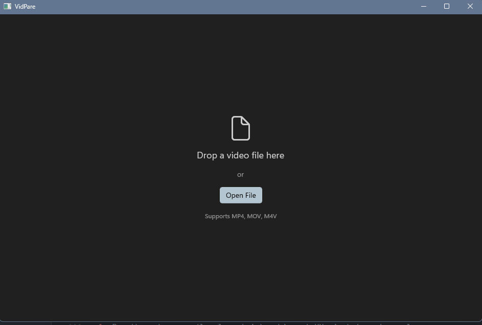
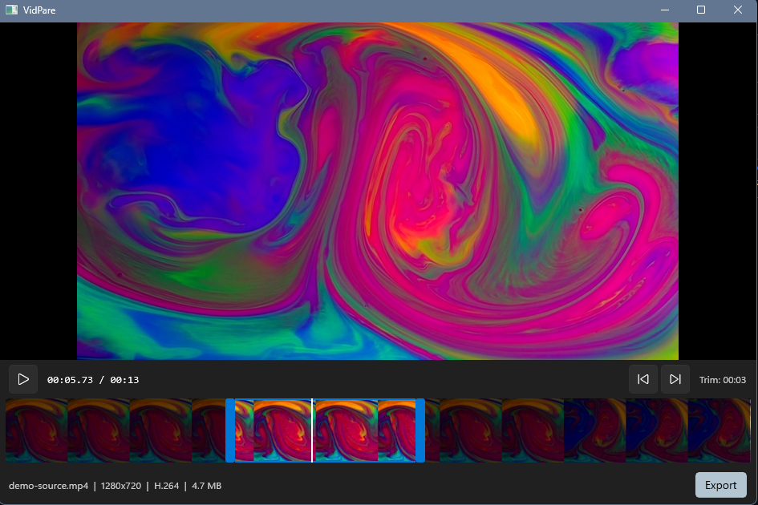

# VidPare for Windows

The Windows implementation of [VidPare](https://github.com/petems/vidpare), sharing the same core focus: a native, intuitive, open source way to trim videos — no wrappers, no bloat, just direct platform APIs.

Built with WinUI 3. Open a video, set your in and out points on the interactive timeline, and export the clip in H.264 or HEVC.




## Features

- Drag-and-drop or file picker to open videos (MP4, MOV, M4V)
- Interactive timeline with thumbnail strip, draggable trim handles, and scrubbable playhead
- Playback controls with play/pause and set-in/set-out buttons
- Export to H.264 or HEVC at Original, 1080p, 720p, or 480p quality
- Progress tracking during export; File Explorer opens to the output on completion

## Requirements

- Windows 11 (build 22000+)
- x64 machine
- [.NET 8 Desktop Runtime](https://dotnet.microsoft.com/download/dotnet/8.0)
- Visual Studio 2022 (for building from source)

> HEVC export uses the codec pre-installed on Windows 11. No additional codec pack is needed.

## Building

```batch
build.bat
```

Or directly:

```batch
dotnet build
```

Then run the app from Visual Studio (F5) or:

```batch
dotnet run --project VidPare.App
```

## Usage

1. **Open a video** — drag a file onto the window or click the open button.
2. **Set trim points** — drag the handles on the timeline, or play to a position and click **Set In** / **Set Out**.
3. **Export** — click Export, choose a format and quality preset, pick a save location, and wait for transcoding to finish.
